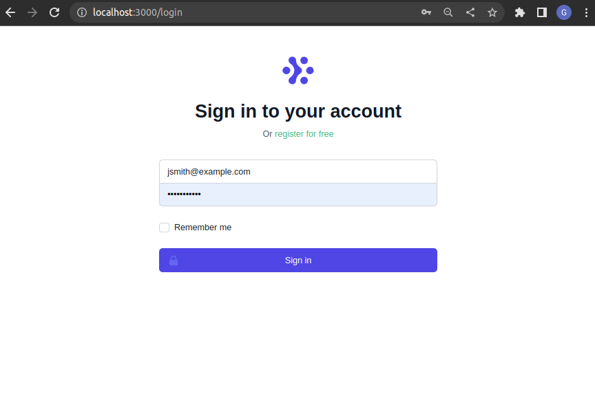
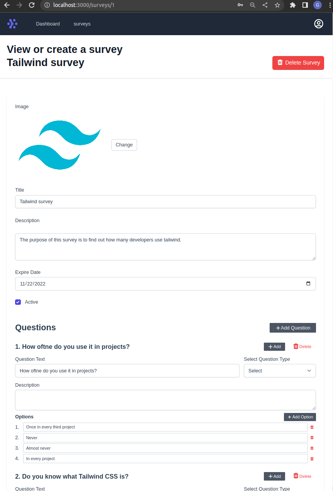
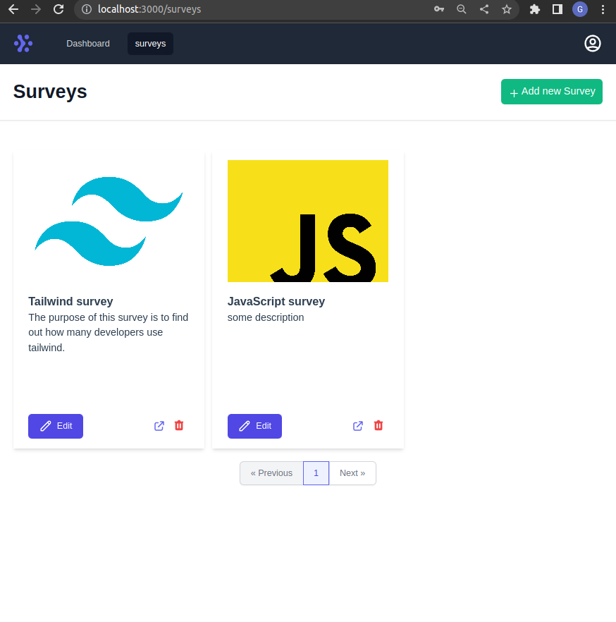
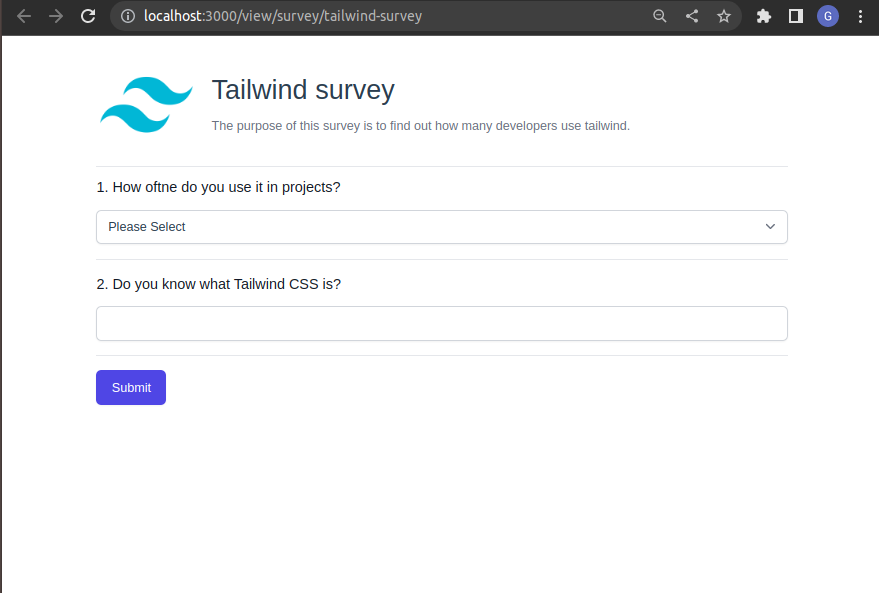

# Laravel Surveys

Laravel surveys is a platform for conducting online surveys. It is built on top of Laravel 8 and uses Vue.js 3 and Tailwind CSS for the front-end.

<table align="center"><tr><td align="center" width="9999">
<a align="center">
 

  

  

  

</a>
</td></tr></table>

